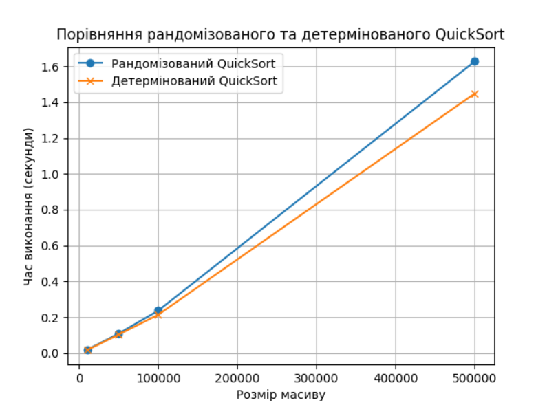
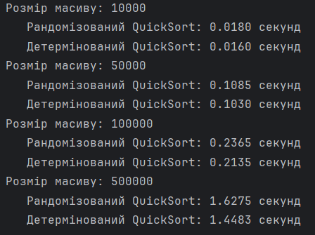
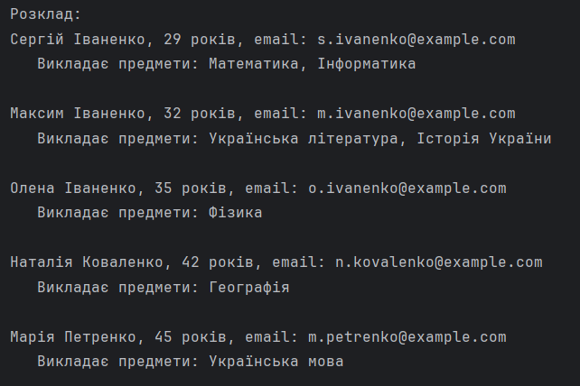

## Table of Contents

- [Task1](#task1)
- [Task2](#task2)


## Task1
Вхідні дані:

 - для масивів розміром 10_000, 50_000, 100_000, 500_000 виконати порівняння рандомізованого та детермінованого QuickSort, 
а також визначити час виконання для кожного масиву.

Results



*Графічне порівняння рандомізованого та детермінованого QuickSort*




*Результати дослідження рандомізованого та детермінованого QuickSort*

  Виходячи з вхідних умов та використання рандомізованого та детермінованого QuickSort, можна зауважити, що детермінований 
QuickSort виконується трохи швидше в усіх тестах, ніж рандомізований QuickSort. Причиною цього може бути кращий вибір опорного 
елементу (який в нашому варіанті є серединою масиву), а також в тому, що дані є задані випадково. Якщо б масиви були відсортовані,
то швидкість сортування рандомізованого QuickSort може бути вище, а детермінований - нижче.
  Але так як різниця між ними не є значним, то обидва алгоритми можуть бути використані.

## Task2

Вхідні дані:

- Назви предметів

```bush
     subjects =  {'Географія', 'Математика', 'Історія України', 'Фізика', 'Українська література', 'Інформатика', 'Українська мова'}
```


- Вчителі

```bush
        teachers = [
        Teacher("Олена", "Іваненко", 35, "o.ivanenko@example.com", {'Математика', 'Фізика'}),
        Teacher("Дмитро", "Петренко", 50, "d.petrenko@example.com", {'Українська література', 'Інформатика'}),
        Teacher("Наталія", "Коваленко", 42, "n.kovalenko@example.com", {'Географія', 'Історія України'}),
        Teacher("Сергій", "Іваненко", 29, "s.ivanenko@example.com", {'Математика', 'Інформатика'}),
        Teacher("Марія", "Петренко", 45, "m.petrenko@example.com", {'Українська література', 'Українська мова'}),
        Teacher("Олександр", "Коваленко", 38, "o.kovalenko@example.com", {'Фізика', 'Інформатика'}),
        Teacher("Максим", "Іваненко", 32, "m.ivanenko@example.com", {'Українська література', 'Історія України'}),
    ]
```

  Згідно вхідних даних, а також умови використання жадібного алгоритму для формування розкладу занять, отримано наступний результат




*Результати побудови розкладу за допомогою жадібного алгоритму*